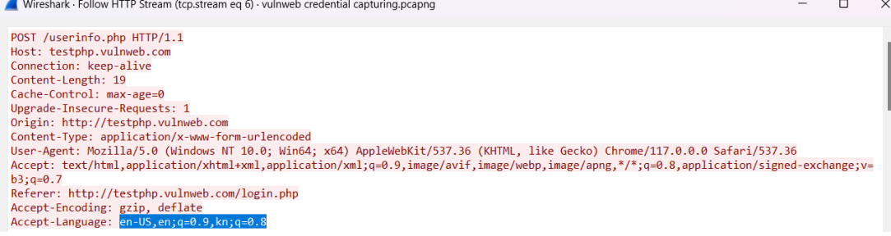

# Computer Networks

# PDF : [Open PDF](./HTTP%20Packet%20Analysis.pdf)
## Wireshark: HTTP Packet Analysis

Wireshark is an open-source packet analyzer which is used for education, analysis, software development, communication protocol development, and network troubleshooting. It is used to track the packets so that each one is filtered to meet our specific needs. It is commonly called a sniffer, network protocol analyzer, and network analyzer. While running Wireshark, the machine's network interface card is put in promiscuous mode.

### Uses of Wireshark

- It is used by network security engineers to examine security problems.
- It allows the users to watch all the traffic being passed over the network.
- It is used by network engineers to troubleshoot network issues.
- It helps to troubleshoot latency issues and malicious activities on your network.
- It can analyze dropped packets.
- It has sort and filter options which make it easy for the user to view the data.
- It can capture raw USB traffic.

## HTTP Packet Analysis

- HTTP stands for HyperText Transfer Protocol.
- HTTP is an application layer protocol in the ISO or TCP/IP model.
- HTTP is used by the World Wide Web, and it defines how messages are formatted and transmitted by the browser.
- HTTP defines rules for what action should be taken when a browser receives an HTTP command and also defines rules for transmitting HTTP commands to get data from the server.
- HTTP uses several methods for communication, for example, GET, HEAD, POST, PUT, DELETE, CONNECT, OPTION, and TRACE.
- HTTP uses port 80 and TCP as the transport layer protocol.

### HTTP Packet Analysis on Wireshark

We can observe from the analysis that an HTTP request is sent from 192.168.1.199 to gaia.cs.umass.edu. It uses the HTTP GET method to access the resource and uses the TCP protocol for data transmission. 

HTTP headers are used to pass additional information. HTTP headers can include information like user-agent, origin, host, connection, cache-control, etc. The image shows the header included within the packet in the Wireshark tool.

### Experiments on HTTP using Wireshark

#### Credential sniffing using Wireshark and vulnweb

- vulnweb is a website designed with vulnerabilities for learning purposes.
- It uses HTTP for login.
- Using Wireshark, we can capture the packets of the vulnweb website.
- We can look into the HTTP POST method because login uses the POST method for sending data to the server.
- We can observe that under HTML form URL encode, we can clearly see the username and password because it is unencrypted.
- Most applications today use encryption for data transmission.

#### Capturing weather app data using Wireshark

- Capturing credentials of the localhost app.
- The above application is built using Node.js and the React library and is running in the localhost environment.
- First, we need to start capturing the packets of the localhost environment by setting the interface as loopback as shown in the figure.
- Both applications use the HTTP protocol for data transmission.
- We have captured both weather data and login credentials of the globebook app.
- The weather app transfers data in form-url-encoded format, whereas globebook sends the data in the form of a JSON object to the server.